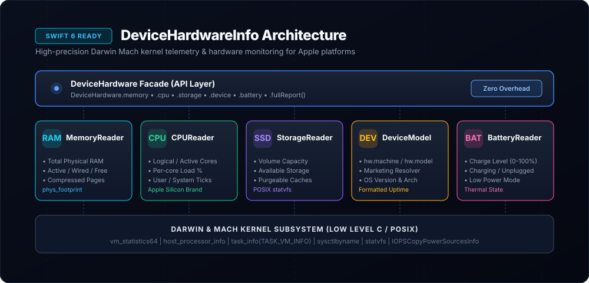

# DeviceHardwareInfo



[](https://swift.org)
[](#platforms)
[](LICENSE)
[](#architecture)

High-precision, thread-safe Apple hardware telemetry engine built in pure Swift 6. Queries Darwin kernel and Mach subsystem APIs (`host_statistics64`, `vm_statistics64`, `host_processor_info`, `task_info(TASK_VM_INFO)`, `sysctlbyname`, `statvfs`) with zero third-party dependencies.

---

## Highlights

- 🧠 **Memory Telemetry (`MemoryReader`)**: Captures total physical RAM, active, inactive, wired, compressed, and free pages. Measures the exact physical memory footprint of your app process (`phys_footprint`), identical to Xcode's Debug Navigator.
- ⚡️ **CPU & Thermals (`CPUReader`)**: Queries logical and active core counts, per-core load percentages across user/system/idle ticks, chip brand (e.g. Apple M2 Pro, Apple A17 Pro), and system thermal states (`nominal`, `fair`, `serious`, `critical`).
- 💾 **Storage Telemetry (`StorageReader`)**: Inspects volume total capacity, raw free space, and available space for important usage (taking system purgeable caches into account) with POSIX `statvfs` fallback.
- 📱 **Device Identification (`DeviceModelReader`)**: Queries hardware identifiers (`hw.machine` / `hw.model`) and maps them to marketing names (e.g., `iPhone16,2` → *iPhone 15 Pro Max*, `Mac14,2` → *MacBook Air 13-inch M2*). Provides formatted uptime.
- 🔋 **Battery & Power (`BatteryReader`)**: Reports real-time battery charge level, power state (charging/unplugged/full), and Low Power Mode status across iOS and macOS.
- 🔒 **Swift 6 Concurrency**: 100% `Sendable` compliant structs, zero data races, thread-safe telemetry sampling.

---

## Architecture Overview

```
Application Layer / SwiftUI Views
       │
       ▼
DeviceHardware (Developer Facade)
 ├── .memory  ──► MemoryReader   ──► mach_host_self() + vm_statistics64 + TASK_VM_INFO
 ├── .cpu     ──► CPUReader      ──► host_processor_info(PROCESSOR_CPU_LOAD_INFO)
 ├── .storage ──► StorageReader  ──► URLResourceValues + statvfs
 ├── .device  ──► DeviceModel    ──► sysctlbyname("hw.machine")
 ├── .battery ──► BatteryReader  ──► UIDevice / IOKit.ps
 └── .fullReport() ─────────────► Synchronized SystemHardwareReport
```

---

## Installation

Add `DeviceHardwareInfo` to your `Package.swift`:

```swift
dependencies: [
    .package(url: "https://github.com/nilkanthdesai76/swift-device-hardware-info.git", from: "1.0.0")
]
```

Or in Xcode: **File** → **Add Package Dependencies...** → Enter repository URL.

---

## Quick Start

### 1. Memory & App Footprint

```swift
import DeviceHardwareInfo

let memory = DeviceHardware.memory

print("Total RAM: \(MemorySnapshot.formatBytes(memory.totalBytes))")
print("Used RAM:  \(MemorySnapshot.formatBytes(memory.usedBytes)) (\(Int(memory.usagePercentage * 100))%)")
print("App Footprint: \(MemorySnapshot.formatBytes(memory.appFootprintBytes))")
```

### 2. CPU & Thermal State

```swift
let cpu = DeviceHardware.cpu

print("Chip: \(cpu.chipName)")
print("Cores: \(cpu.activeCoreCount) active / \(cpu.logicalCoreCount) logical")
print("Overall CPU Usage: \(Int(cpu.overallUsagePercentage * 100))%")

for core in cpu.coreLoads {
    print("Core \(core.coreIndex): User \(Int(core.userPercentage * 100))% | Sys \(Int(core.systemPercentage * 100))%")
}

if cpu.thermalState == .critical {
    print("⚠️ Thermal throttling active!")
}
```

### 3. Storage Monitoring

```swift
let storage = DeviceHardware.storage

print("Total Capacity: \(StorageSnapshot.formatBytes(storage.totalBytes))")
print("Available Space: \(StorageSnapshot.formatBytes(storage.availableBytes))")
print("Disk Usage: \(Int(storage.usagePercentage * 100))%")
```

### 4. Device Marketing Name & Uptime

```swift
let device = DeviceHardware.device

print("Device: \(device.marketingName) [\(device.hardwareIdentifier)]")
print("OS: \(device.osVersion)")
print("Uptime: \(device.formattedUptime)")
```

### 5. Battery & Power State

```swift
let battery = DeviceHardware.battery

print("Battery: \(battery.formattedLevel) (\(battery.state.rawValue))")
print("Low Power Mode: \(battery.isLowPowerModeEnabled ? "Active" : "Disabled")")
```

### 6. Full Synchronized Report

```swift
let report = DeviceHardware.fullReport()
print("Captured system telemetry at \(report.timestamp)")
```

---

## SwiftUI Integration

```swift
import SwiftUI
import DeviceHardwareInfo

struct HardwareMonitorView: View {
    @State private var memory = DeviceHardware.memory
    @State private var cpu = DeviceHardware.cpu
    @State private var timer = Timer.publish(every: 2.0, on: .main, in: .common).autoconnect()

    var body: some View {
        List {
            Section("Memory") {
                LabeledContent("App Footprint", value: MemorySnapshot.formatBytes(memory.appFootprintBytes))
                LabeledContent("RAM Usage", value: "\(Int(memory.usagePercentage * 100))%")
                ProgressView(value: memory.usagePercentage)
            }

            Section("Processor") {
                LabeledContent("Chip", value: cpu.chipName)
                LabeledContent("Load", value: "\(Int(cpu.overallUsagePercentage * 100))%")
                ProgressView(value: cpu.overallUsagePercentage)
            }

            Section("Device") {
                LabeledContent("Model", value: DeviceHardware.device.marketingName)
                LabeledContent("Uptime", value: DeviceHardware.device.formattedUptime)
            }
        }
        .onReceive(timer) { _ in
            memory = DeviceHardware.memory
            cpu = DeviceHardware.cpu
        }
    }
}
```

---

## Platforms

- macOS 12.0+
- iOS 15.0+
- tvOS 15.0+
- watchOS 8.0+

---

## License

MIT License. See [LICENSE](LICENSE) for details.
Authored by [Nilkanth Desai](https://github.com/nilkanthdesai76).
